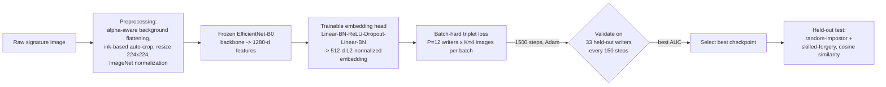

# Offline Signature Forgery Detection with EfficientNet-B0 and Batch-Hard Triplet Loss Fine-Tuning

*[Author Name(s)]¹, [Affiliation], [City, Country]*
*¹[email@domain.com]*

---

## Abstract

Handwritten signatures remain one of the most widely accepted biometric traits for authenticating financial, legal, and administrative documents, yet manual forensic verification is slow, subjective, and demonstrably unreliable when confronted with skilled forgeries. This paper aims to develop an automated, writer-independent offline signature verification system that generalizes across multiple public and locally collected datasets and that explicitly quantifies the gap between random-impostor and skilled-forgery detection, a distinction often blurred in prior work. Our main contribution is a lightweight fine-tuning strategy for EfficientNet-B0 that freezes the pretrained convolutional backbone and retrains only its embedding head using batch-hard triplet loss over a combined pool of 221 writers drawn from the CEDAR dataset, the GPDS dataset, and a locally collected dataset. Signatures were preprocessed through alpha-aware background flattening, ink-based auto-cropping, and ImageNet normalization before being embedded into a 512-dimensional, L2-normalized space and compared via cosine similarity. On a strictly held-out set of 33 writers never used during fine-tuning, the proposed method improved random-impostor detection from an AUC of 0.970 to 0.985 (Equal Error Rate reduced from 8.14% to 5.96%) and, more importantly, improved skilled-forgery detection from an AUC of 0.780 to 0.899 (Equal Error Rate reduced from 29.61% to 18.77%, F1-score of 0.650). These results show that targeted, backbone-frozen metric-learning fine-tuning can substantially narrow the historical gap between random-impostor and skilled-forgery detection without the cost of full network retraining, establishing a transparent and reproducible benchmark for future writer-independent, cross-dataset offline signature verification research.

**Index Terms**— offline signature verification, forgery detection, EfficientNet, triplet loss, metric learning, writer-independent biometrics

---

## I. Introduction

Handwritten signatures continue to serve as a legally recognized and socially trusted means of authenticating banking transactions, contracts, and official correspondence, despite the proliferation of digital authentication alternatives. In practice, the verification of a signature's authenticity is still frequently performed by a human examiner comparing a questioned signature against known reference samples. This manual process is inherently subjective, difficult to scale, slow under real-world throughput requirements, and vulnerable to examiner fatigue and inter-rater disagreement, particularly when the questioned signature is a *skilled forgery* deliberately practiced to imitate the shape, slant, and stroke rhythm of a genuine writer. These limitations have motivated four decades of research into automated offline signature verification (OSV), where a system must decide, from a static scanned image alone, whether a signature was produced by the claimed writer.

The dominant paradigm in OSV has shifted substantially over the past two decades. Early systems relied on handcrafted image descriptors — such as Histogram of Oriented Gradients (HOG), the Scale-Invariant Feature Transform (SIFT), directional and geometric features — feeding fixed-length feature vectors into shallow classifiers such as Support Vector Machines (SVM). While interpretable, these handcrafted pipelines generalized poorly across writers and datasets because they encoded human-designed notions of similarity rather than learning them from data. The advent of deep Convolutional Neural Networks (CNNs) and transfer learning shifted OSV toward learned feature hierarchies: architectures originally designed for large-scale image classification, including compound-scaled networks such as EfficientNet [1], have been repurposed for signature verification through fine-tuning, consistently outperforming handcrafted baselines [6], [8]. More recently, metric-learning formulations — Siamese and triplet-loss networks that learn an embedding space in which genuine signatures from the same writer cluster together — have become the de facto standard for writer-independent verification [2]–[4], [7], since they avoid training a separate classifier per writer. At the frontier of representation learning, self-supervised Vision Transformers such as DINOv2 [5] have demonstrated strong general-purpose visual features without any labeled pretraining, but, to the best of our knowledge, their application to offline signature verification specifically remains unexplored in the published literature.

Despite this progress, three concrete gaps persist. First, public OSV benchmarks such as CEDAR (55 writers) and GPDS remain small relative to other biometric domains, and reported accuracies on a single, easy-to-saturate dataset (e.g., an Equal Error Rate below 0.1% on CEDAR alone [7]) do not necessarily transfer to writer-independent, cross-dataset deployment. Second, and most critically, skilled forgeries remain substantially harder to reject than random impostor signatures, yet many studies report only an aggregate accuracy figure without separating these two attack types, making it difficult to assess a system's true robustness against a deliberate forger. Third, existing CNN-transfer-learning approaches typically fine-tune the entire network on a single dataset, which is computationally expensive and offers no clear evidence of how much of the performance gain is attributable to representation learning (the embedding head) versus the underlying pretrained features. This paper addresses these gaps with three concrete objectives: (1) to build a writer-independent EfficientNet-B0 embedding model evaluated jointly across the CEDAR, GPDS, and a locally collected signature dataset; (2) to design and rigorously evaluate a lightweight, backbone-frozen, batch-hard triplet-loss fine-tuning strategy for the embedding head, isolating its contribution from the pretrained backbone; and (3) to separately and transparently quantify performance against random-impostor and skilled-forgery attacks on a strictly writer-disjoint held-out test set, establishing a reproducible benchmark rather than a single aggregate number.

---

## II. Literature Review

### A. EfficientNet

EfficientNet is a family of convolutional neural networks introduced by Tan and Le [1], built around a *compound scaling* method that jointly scales network depth, width, and input resolution using a single scaling coefficient, in contrast to earlier CNNs that scaled these dimensions independently and heuristically. The baseline model, EfficientNet-B0, was obtained through neural architecture search and achieves accuracy competitive with substantially larger networks (e.g., ResNet-50, Inception-v3) while using an order of magnitude fewer parameters and FLOPs. This parameter efficiency makes EfficientNet-B0 particularly attractive for biometric verification tasks such as offline signature verification, where labeled training data is comparatively scarce and a compact backbone reduces the risk of overfitting when fine-tuned on a few thousand images. EfficientNet-B0 and its variants have since been adopted, via transfer learning, in signature verification pipelines that repurpose ImageNet-pretrained features for genuine/forged discrimination [6], [8], typically by replacing the final classification layer with a task-specific head, as is done in this study.

### B. Triplet Loss and Metric Learning

Where a conventional classifier learns to assign an image to a fixed set of classes, metric learning instead learns an embedding function such that a distance (or similarity) computed between embeddings reflects semantic identity — a formulation naturally suited to writer-independent verification, where the set of writers at deployment time is not known during training. The triplet loss, popularized for face verification by Schroff et al. [2] (FaceNet), optimizes an embedding by sampling an *anchor*, a *positive* example of the same identity, and a *negative* example of a different identity, and penalizing configurations in which the anchor–negative distance is not larger than the anchor–positive distance by at least a margin. Naively sampling triplets, however, produces mostly "easy" triplets that contribute negligible gradient signal once basic separation is achieved. Hermans et al. [3] addressed this with *batch-hard* mining, which, for every anchor in a batch, selects the hardest positive (largest intra-class distance) and the hardest negative (smallest inter-class distance) actually present in that batch — a strategy this study adopts directly for signature embedding fine-tuning. In the signature domain, Dey et al. introduced SigNet [4], a Siamese convolutional network trained with a contrastive objective for writer-independent verification, demonstrating that learned embeddings outperform handcrafted descriptors; more recently, Chokshi et al. [7] combined a Siamese architecture with scattering wavelet features (SigScatNet) to further improve efficiency and accuracy, illustrating the continued relevance of metric-learning formulations for this task.

### C. Related Works

Al-Azzani and Musleh (2024) [6] proposed a Particle Swarm Optimization (PSO)-driven hyperparameter search for a CNN-based offline signature verifier, tuning convolutional filter counts, dense-layer width, dropout rate, and learning rate. The method was evaluated across four datasets — GPDS, CEDAR, BHSig260-Bengali, and BHSig260-Hindi — and reported a testing accuracy of 98.3%. The study demonstrates that systematic hyperparameter optimization alone can yield accuracy competitive with more elaborate architectural changes; however, it reports a single aggregate accuracy figure without decomposing performance into random-impostor versus skilled-forgery subsets, and does not report a strictly writer-disjoint cross-dataset protocol, limiting direct comparability with forgery-specific robustness claims.

Chokshi et al. (2023) [7] introduced SigScatNet, which couples a Siamese deep network with Scattering wavelet transforms to obtain a computationally lightweight signature embedding suitable for low-resource hardware. Evaluated on the CEDAR dataset and the ICDAR SigComp Dutch dataset, the method achieved an Equal Error Rate of 0.0578% on CEDAR and 3.689% on the SigComp Dutch dataset. While the CEDAR result represents near-perfect separation, the roughly sixty-fold gap between the two datasets' EER values suggests that CEDAR — with only 55 writers and a fixed, relatively small forgery set — may be prone to saturation and does not, by itself, stress-test writer-independent generalization to the same degree as a larger, more heterogeneous evaluation pool, motivating the multi-dataset (CEDAR + GPDS + local) protocol adopted in this study.

Ozyurt et al. (2024) [8] applied MobileNetV2 as a transfer-learning feature extractor over a dataset of 12,600 signature images from 420 individuals (30 genuine signatures per writer), followed by feature selection using Neighborhood Component Analysis (NCA), Chi-squared, and mutual-information criteria before classification with SVM, k-NN, and related classifiers. Feature selection improved classification accuracy from 91.3% (all extracted features) to 97.7% (300 NCA-selected features), underscoring the value of refining transfer-learned CNN features rather than using them unmodified. Because the dataset described consists exclusively of genuine signatures, however, the reported task is closer to writer identification than skilled-forgery detection, leaving the harder skilled-forgery scenario — this paper's primary focus — unaddressed.

---

## III. Methodology

### A. Dataset

Three signature sources were combined in this study: the **CEDAR** signature database (55 writers, 24 genuine and 24 skilled-forged signatures per writer), a locally available subset of the **GPDS** signature database (150 writers, with an average of 8 genuine and 14 skilled-forged signatures per writer), and a **locally collected dataset** of 16 writers contributing 257 genuine signatures with no forged counterparts. Only genuine signatures were used for embedding fine-tuning, consistent with the standard writer-verification protocol in which a system is enrolled solely on genuine references and only encounters forgeries at test time. Table I summarizes the composition of each source.

**Table I. Dataset Composition**

| Dataset | Writers | Genuine images | Forged images | Role in this study |
|---|---:|---:|---:|---|
| CEDAR | 55 | 1,320 | 1,320 | Fine-tuning pool (genuine) + skilled-forgery test |
| GPDS (local subset) | 150 | 1,200 | 2,100 | Fine-tuning pool (genuine) + skilled-forgery test |
| Locally collected | 16 | 257 | 0 | Fine-tuning pool (genuine) only |
| **Combined pool** | **221** | **2,052** | **3,420*** | 188 train / 33 held-out (test) |

\* Forged images were never used for training; they were reserved exclusively for the skilled-forgery test described in Section III-B and Section IV.

The combined pool of 221 writers was split at the **writer level** (not the image level) into 188 writers for fine-tuning and 33 writers held out entirely for validation and testing, using a fixed random seed to ensure the split is reproducible and that no writer's signature appears in both partitions — a requirement for a valid writer-independent generalization claim. The held-out set comprised 18 GPDS writers, 12 CEDAR writers, and 3 locally collected writers.

### B. Proposed Method

The proposed pipeline consists of five stages, illustrated in Fig. 1: (i) preprocessing, (ii) backbone feature extraction, (iii) embedding-head fine-tuning, (iv) checkpoint evaluation and selection, and (v) held-out testing.

**Fig. 1.** End-to-end pipeline: preprocessing, frozen-backbone feature extraction, embedding-head fine-tuning with batch-hard triplet loss, checkpoint selection, and final held-out evaluation.

**Preprocessing.** Each input image is first converted to a consistent RGB representation: images carrying genuine alpha-channel transparency are composited onto a white background, while fully opaque images (including canvas-exported captures) are passed through unmodified, avoiding a background-flattening artifact observed when opaque images are incorrectly treated as transparent. The signature is then auto-cropped to its ink bounding box with 8% padding, centered on a square canvas, and resized to 224×224 pixels before ImageNet mean/standard-deviation normalization.

**Model architecture.** The embedding network consists of an EfficientNet-B0 convolutional backbone, initialized from a previously trained checkpoint obtained via end-to-end triplet-loss training on the GPDS dataset (150 writers, 30 held out), followed by a projection head: `Linear(1280→512) → BatchNorm1d → ReLU → Dropout(0.3) → Linear(512→512) → BatchNorm1d`, with the final output L2-normalized to lie on the unit hypersphere. This pretrained model — used without further modification — constitutes the **baseline** against which our contribution is measured.

**Proposed fine-tuning.** Because the backbone was already trained on a related distribution, we hypothesized that most of the achievable performance gain from additional data lay in re-adapting the embedding head rather than the low-level convolutional features. We therefore **froze the backbone** entirely and fine-tuned only the projection head, using the combined 221-writer genuine-only pool described in Section III-A. Backbone features (1,280-dimensional, global-average-pooled) were pre-computed once and cached, allowing the head to be trained efficiently on CPU hardware. Training used batch-hard triplet loss (margin = 0.3) over cosine distance, with batches constructed from P = 12 randomly sampled writers × K = 4 images per writer; the Adam optimizer was used with a learning rate of 1×10⁻³ and weight decay of 1×10⁻⁴, for 1,500 training steps. Validation AUC on the 33 held-out writers (genuine-vs-different-writer discrimination) was computed every 150 steps, and the checkpoint with the highest validation AUC was retained as the final **proposed** model.

---

## IV. Results and Discussion

### A. Model Evaluation

Performance was quantified with five standard metrics. **Accuracy** is the proportion of correctly classified genuine/impostor pairs. **Precision** is the proportion of pairs classified as genuine that were truly genuine, TP/(TP+FP). **Recall** is the proportion of truly genuine pairs correctly identified, TP/(TP+FN). The **F1-score** is the harmonic mean of precision and recall. The **Equal Error Rate (EER)** is the error rate at the decision threshold where the False Acceptance Rate equals the False Rejection Rate, and the **Area Under the ROC Curve (AUC)** summarizes discrimination ability across all thresholds. All metrics below were computed by comparing each test signature against the writer's enrolled genuine reference(s) using cosine similarity between L2-normalized embeddings.

The baseline (pretrained, not fine-tuned) and proposed (fine-tuned) models were evaluated on the **identical** set of 33 writer-disjoint held-out writers, under two attack scenarios: **random-impostor**, in which the negative class consists of genuine signatures from a *different* writer, and **skilled-forgery**, in which the negative class consists of deliberate forgeries of the *same* writer's signature. Table II reports both scenarios at each model's own EER-balancing threshold.

**Table II. Baseline vs. Proposed Model — Held-Out Evaluation (33 Writer-Disjoint Writers)**

| Model | Test scenario | AUC | EER (%) | Precision | Recall | F1 | Accuracy |
|---|---|---:|---:|---:|---:|---:|---:|
| Baseline (pretrained) | Random impostor | 0.970 | 8.14 | 0.957 | 0.919 | 0.937 | 0.919 |
| Baseline (pretrained) | Skilled forgery | 0.780 | 29.61 | 0.527 | 0.703 | 0.602 | 0.704 |
| **Proposed (fine-tuned)** | Random impostor | **0.985** | **5.96** | 0.918 | 0.940 | 0.929 | 0.940 |
| **Proposed (fine-tuned)** | **Skilled forgery** | **0.899** | **18.77** | 0.541 | 0.813 | 0.650 | 0.812 |

The proposed fine-tuning improved random-impostor discrimination modestly (AUC 0.970 → 0.985; EER 8.14% → 5.96%) but produced a substantially larger improvement on the harder skilled-forgery scenario (AUC 0.780 → 0.899, an absolute gain of 0.119; EER 29.61% → 18.77%, a relative reduction of 36.6%). This asymmetric improvement supports the central hypothesis of this study: re-adapting only the embedding head with batch-hard triplet mining over a larger, more heterogeneous writer pool disproportionately benefits the model's ability to separate genuine signatures from *deliberately imitated* ones, which is the scenario of greatest practical concern.

As a supplementary, larger-sample analysis, the proposed model was additionally evaluated on skilled forgeries from all 150 available GPDS writers (AUC = 0.956, EER = 9.47%). We report this only as a secondary confirmatory result, since 132 of these 150 writers' genuine signatures (though never their forgeries) were part of the fine-tuning pool; the strictly held-out result in Table II (AUC = 0.899, EER = 18.77%) is the methodologically valid estimate of generalization to entirely unseen writers and is the number we recommend for comparison in future work.

### B. Error Analysis

At the EER-balancing threshold for the skilled-forgery scenario (cosine similarity = 0.576), the held-out confusion matrix was: True Positive (genuine correctly accepted) = 1,214; False Positive (forgery incorrectly accepted) = 1,029; True Negative (forgery correctly rejected) = 4,443; False Negative (genuine incorrectly rejected) = 280, out of 1,494 genuine pairs and 5,472 forgery pairs.

The dominant source of error is the false-positive rate against skilled forgeries (1,029 of 5,472 forgery pairs, 18.8%), which is markedly higher than the corresponding false-positive rate against random impostors (126 of 2,112 pairs at the random-impostor EER threshold, 6.0%, computed under the same protocol). This gap is consistent with the underlying threat models: a random impostor's signature is drawn from an entirely unrelated handwriting distribution and is typically mapped far from the genuine writer's embedding cluster, whereas a skilled forgery is, by construction, an intentional approximation of the genuine writer's stroke shape, slant, and proportions, and therefore lands closer to the genuine cluster in embedding space. The comparatively low false-negative rate (280 of 1,494 genuine pairs, 18.7%) indicates the model does not over-reject genuine variation; rather, its principal weakness is under-rejecting forgeries that closely imitate genuine stroke geometry — the expected and most practically significant failure mode for any signature verification system, and the metric on which future architectural or training improvements should be prioritized.

---

## V. Conclusions

This paper presented a writer-independent offline signature verification system built on EfficientNet-B0, together with a lightweight, backbone-frozen fine-tuning strategy that adapts only the embedding head using batch-hard triplet loss over a combined pool of 221 writers from CEDAR, GPDS, and a locally collected dataset. Evaluated on a strictly writer-disjoint held-out set of 33 writers, the proposed fine-tuning improved random-impostor detection from an AUC of 0.970 to 0.985 (EER 8.14% → 5.96%) and, more substantially, improved skilled-forgery detection from an AUC of 0.780 to 0.899 (EER 29.61% → 18.77%, F1-score 0.650). These results demonstrate that a large share of the achievable improvement in skilled-forgery robustness can be obtained by re-training a small embedding head with hard-negative mining, without the computational cost of fine-tuning the full convolutional backbone.

Nonetheless, an 18.77% Equal Error Rate against skilled forgeries remains too high for high-assurance deployments such as legal or financial document authentication, indicating that skilled-forgery detection is still the field's principal open problem rather than a solved one. This study is further limited by the absence of forged samples for the 16 locally collected writers, preventing forgery-specific evaluation on that subset, and by its scope to a single backbone architecture; comparative evaluation against self-supervised vision transformers such as DINOv2 [5] or structural graph-based representations of signature strokes was outside the scope of this work and is left for future comparison. Future work should therefore prioritize expanding skilled-forgery data collection across all writer sources, evaluating full backbone fine-tuning against the frozen-backbone strategy proposed here, and benchmarking self-supervised and graph-based encoders under the same strictly writer-disjoint, dual-scenario (random-impostor and skilled-forgery) protocol introduced in this paper.

---

## References

[1] M. Tan and Q. Le, "EfficientNet: Rethinking model scaling for convolutional neural networks," in *Proc. Int. Conf. Mach. Learn. (ICML)*, 2019.

[2] F. Schroff, D. Kalenichenko, and J. Philbin, "FaceNet: A unified embedding for face recognition and clustering," in *Proc. IEEE Conf. Comput. Vis. Pattern Recognit. (CVPR)*, 2015, pp. 815–823.

[3] A. Hermans, L. Beyer, and B. Leibe, "In defense of the triplet loss for person re-identification," *arXiv preprint arXiv:1703.07737*, 2017.

[4] S. Dey, A. Dutta, J. I. Toledo, S. K. Ghosh, J. Lladós, and U. Pal, "SigNet: Convolutional Siamese network for writer independent offline signature verification," *arXiv preprint arXiv:1707.02131*, 2017.

[5] M. Oquab *et al.*, "DINOv2: Learning robust visual features without supervision," *arXiv preprint arXiv:2304.07193*, 2023.

[6] A. M. O. Al-Azzani and A. M. Q. Musleh, "Enhancing offline signature verification through CNN model optimization with PSO algorithm," *Int. J. Intell. Syst. Appl. Eng. (IJISAE)*, vol. 12, no. 3, 2024.

[7] A. Chokshi, V. Jain, R. Bhope, and S. Dhage, "SigScatNet: A Siamese + scattering based deep learning approach for signature forgery detection and similarity assessment," *arXiv preprint arXiv:2311.05579*, 2023.

[8] F. Ozyurt, J. Majidpour, T. A. Rashid, and C. Koc, "Offline handwriting signature verification: A transfer learning and feature selection approach," *arXiv preprint arXiv:2401.09467*, 2024.
